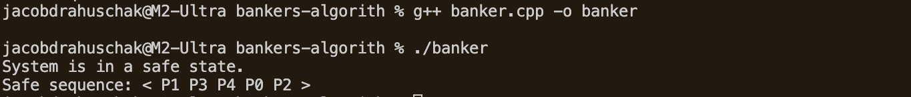

# Bankers-Algorithm
This is a simple C++ program that implements the Banker’s Algorithm for deadlock avoidance. It reads a list of processes, their allocated and maximum resources from an input file, and then checks if the system is in a safe state.  If it is safe, the program prints the safe sequence of processes that can run without causing deadlock.

This project implements the Banker’s Algorithm, which is used in operating systems to avoid deadlock. The program checks whether a system with multiple processes and resource types is in a safe state, and if so, it finds a safe sequence in which processes can run without causing deadlock.

The program reads data from an input file (input.txt) that contains:

The total number of resources of each type

The allocation matrix showing how many resources each process currently holds

The maximum matrix showing the maximum resources each process may request

It then calculates the available resources and the remaining need for each process. Using the safety algorithm, it determines whether a safe sequence exists. If it does, the program prints the safe sequence; otherwise, it indicates that the system is not in a safe state.

How to Use

Make sure banker.cpp and input.txt are in the same folder.

Input File Format (input.txt)

Line 1: Total resources (space-separated, one number per resource type)

Next 5 lines: Allocation matrix for 5 processes

Next 5 lines: Maximum resource matrix for 5 processes

EXAMPLE:

then,

Compile the program with:
g++ banker.cpp -o banker
./banker (if on mac)

Should recieve a message like this if a safe state is possible.

